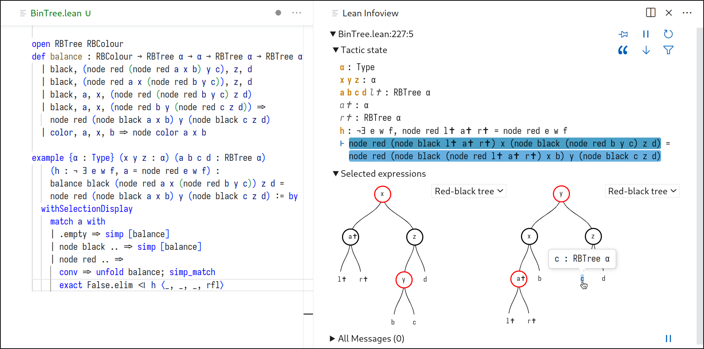

# ProofWidgets

ProofWidgets is a library of user interface components for [Lean 4](https://leanprover.github.io/). It
supports:
- symbolic visualizations of mathematical objects and data structures
- data visualization
- interfaces for tactics and tactic modes
- alternative and domain-specific goal state displays
- user interfaces for entering expressions and editing proofs

Authors: Wojciech Nawrocki, E.W.Ayers with contributions from Tomáš Skřivan

### How does ProofWidgets relate to user widgets?

ProofWidgets relies on the [user widgets](https://leanprover.github.io/lean4/doc/examples/widgets.lean.html)
mechanism built into Lean. User widgets provide the minimum of functionality needed to enable
custom user interfaces. ProofWidgets builds on top of this with a higher-level component library,
syntax sugar, and user-friendly abstractions. Stable parts of ProofWidgets may eventually be
backported into Lean core, but ProofWidgets overall will remain a separate library
for the foreseeable future.

## Usage

### Viewing the demos

To get started, clone ProofWidgets and run `lake build`, as follows:

```bash
git clone https://github.com/leanprover-community/ProofWidgets4 --depth 1
cd ProofWidgets4/
lake build
```

After doing this you will hopefully be able to view the demos in `ProofWidgets/Demos/`.
Top tip: use the pushpin icon ()
to keep a widget in view. You can then live-code your widgets.

### Using ProofWidgets as a dependency

To ensure ProofWidgets works with your version of the Lean toolchain,
reference a **release tag** rather than the `main` branch.
Add the following to your `lakefile.lean`:

```lean
-- Replace v0.0.3 with a version published under Releases
require "leanprover-community" / "proofwidgets" @ git "v0.0.3"
```

[Developing ProofWidgets](#developing-proofwidgets) involves building TypeScript code with NPM.
When depending on `ProofWidgets` but not writing any custom TypeScript yourself,
you may want to spare yourself and your users from having to install and run NPM.
This repository contains pre-built JavaScript files (`widget/js/`)
which will be reused as long as none of the sources have changed.
Consequently, you and your users should not need to have NPM installed.

However, in case there is a bug in the build process,
ProofWidgets may still revert to a full build.
You can force ProofWidgets to fail with a custom error instead by importing it like so:

```lean
-- Replace v0.0.3 with a version published under Releases
require "leanprover-community" / "proofwidgets" @ git "v0.0.3"
  with NameMap.empty.insert `errorOnBuild "<my message>"
```

⚠️ [EXPERIMENTAL] To use ProofWidgets4 JS components in widgets defined in other Lean packages,
import [@leanprover-community/proofwidgets4](https://www.npmjs.com/package/@leanprover-community/proofwidgets4) from NPM.

## Features



### JSX-like syntax

```lean
import ProofWidgets.Component.HtmlDisplay
open scoped ProofWidgets.Jsx

-- click on the line below to see it in your infoview!
#html <b>You can use HTML in Lean {.text s!"{1 + 3}"}!</b>
```

See the `Jsx.lean` and `ExprPresentation.lean` demos.

### Support for libraries

We have good support for building diagrams with [Penrose](https://penrose.cs.cmu.edu/), and expose
some [Recharts](https://recharts.org/en-US/) components for plotting functions and other kinds of
data. See the `Venn.lean` and `Plot.lean` demos.

For more purpose-specific integrations of libraries see the `Rubiks.lean` and `RbTree.lean` demos.

### Custom `Expr` displays

Just like delaborators and unexpanders allow you to customize how expressions are displayed as text,
ProofWidgets allows "delaborating" into (potentially interactive) HTML. See the
`ExprPresentation.lean` demo.

### Multi-stage interactions

Proof widgets can be used to create proving loops involving user interactions and running tactics
in the background. See the `LazyComputation.lean` demo, and the `Conv.lean` demo for an example of
editing the proof script.

### Animated HTML

As a hidden feature, you can also make animated widgets using the `AnimatedHtml` component. This
works particularly well with libraries that ease between different plots, for example Recharts.
You can see an example of how to do this in the `Plot.lean` demo.

## Developing ProofWidgets

**Contributions are welcome!** Check out issues tagged with "good first issue".

The package consists of widget user interface modules written in TypeScript (under `widget/`),
and Lean modules (under `ProofWidgets/`).
To build ProofWidgets from source,
you must have NPM (the [Node.js](https://nodejs.org/en) package manager) installed.
During a build, we first compile the TypeScript widget code using NPM,
and afterwards build all Lean modules.
Lean modules may use TypeScript compilation outputs.
The Lakefile handles all of this, so executing `lake build` should suffice to build the entire package.
In order to build only the TypeScript, run `lake build widgetJsAll`.
Widgets can also be built in development mode using `lake build widgetJsAllDev`.
This makes them easier to inspect in developer tools.

We use the `include_str` term elaborator
to splice the minified JavaScript
produced during the first part of the build (by `tsc` and Rollup)
into ProofWidgets Lean modules.
The minifed JS is stored in `widget/js/`.
Modifying any TypeScript source will trigger a rebuild,
and should correctly propagate the new minified code
to where it is used in Lean.

⚠️ Note however that due to Lake issue [#86](https://github.com/leanprover/lake/issues/86),
*all* the widget sources are rebuilt whenever any single one changes,
which might take a while.

## Cite

We have written [a paper describing the design of ProofWidgets4](https://drops.dagstuhl.de/opus/volltexte/2023/18399/).

If this work helps you in your own research, you can cite it as follows:
```bibtex
@InProceedings{nawrocki_et_al:LIPIcs.ITP.2023.24,
  author =	{Nawrocki, Wojciech and Ayers, Edward W. and Ebner, Gabriel},
  title =	{{An Extensible User Interface for Lean 4}},
  booktitle =	{14th International Conference on Interactive Theorem Proving (ITP 2023)},
  pages =	{24:1--24:20},
  series =	{Leibniz International Proceedings in Informatics (LIPIcs)},
  ISBN =	{978-3-95977-284-6},
  ISSN =	{1868-8969},
  year =	{2023},
  volume =	{268},
  editor =	{Naumowicz, Adam and Thiemann, Ren\'{e}},
  publisher =	{Schloss Dagstuhl -- Leibniz-Zentrum f{\"u}r Informatik},
  address =	{Dagstuhl, Germany},
  URL =		{https://drops.dagstuhl.de/opus/volltexte/2023/18399},
  URN =		{urn:nbn:de:0030-drops-183991},
  doi =		{10.4230/LIPIcs.ITP.2023.24},
  annote =	{Keywords: user interfaces, human-computer interaction, Lean}
}
```
